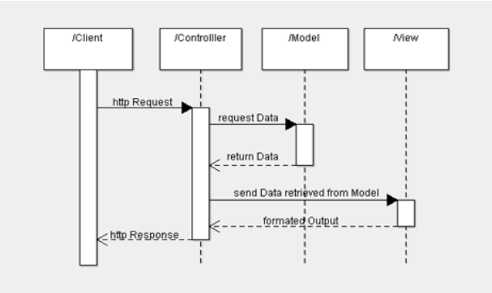

# Pemrograman Berorientasi Objek dan Model View Controller

### 12.1 Dasar Teori

a) [OOP](https://www.w3schools.com/php/php_oop_what_is.asp)

PHP OOP atau Pemrograman Berorientasi Objek dalam PHP adalah prinsip bahasa pemrograman yang digunakan untuk membangun aplikasi web yang kompleks dan dapat digunakan kembali. OOP merupakan pendekatan yang kuat untuk mengorganisir dan mengelola kode dalam proyek-proyek PHP

### 12.2 Prosedur Praktikum

**a) Studi Kasus**

Thalita dan Amelia adalah 2 orang mahasiswa FILKOM yang selama mereka berkuliah mereka membentuk perusahaan startup TA Innovation yang bergerak pada bidang pengembangan aplikasi web. Saat ini mereka sedang bekerja sama dengan BEM FILKOM untuk mengembangkan sebuah website yang nantinya dapat digunakan untuk membantu proses pembuatan dan evaluasi program kerja pada salah satu kementerian pada BEM FILKOM. Dari proses observasi dan analisis kebutuhan yang mereka lakukan, mereka mendapatkan spesifikasi kebutuhan sebagai berikut.

    1. Ada 2 tipe pengguna yang dapat menggunakan sistem ini:
        a) Menteri yang bertanggung jawab untuk melakukan monitoring
        program kerja yang sudah berjalan
        b) Kepala Departemen yang bertanggung jawab untuk membentuk tim
        dan mengeksekusi program kerja yang sudah dilakukan

    2. Semua pengguna pada dasarnya adalah pengurus BEM yang memiliki data
        sebagai berikut:
        a) Nama
        b) NIM
        c) Angkatan
        d) Jabatan
        e) Foto

    3. Terdapat data program kerja yang harus disimpan dalam database
        dengan struktur data sebagai berikut:
        a) Nomor
        b) Nama program
        c) Surat Keterangan

    Proses pengembangan aplikasi web ini dilakukan dengan bahasa PHP.
    Sistem ini dikembangkan dengan dibagi melalui 2 tahap, yang pertama adalah
    tahap pengembangan arsitektur sistem dan yang kedua adalah tahap
    pengembangan fungsionalitas sistem.

**b) Latian 1**

Buatlah pemodelan class diagram dan entity relationship diagram sesuai dengan analisis dan perancangan sistem yang sudah dibuat.

**c) Latian 2**

Buatlah folder baru dalam folder htdocs dan beri nama oop, seluruh kode Latihan 2 ini disimpan dalam folder oop

Membuat pemodelan struktur pengguna sistem dengan menuliskan kode di bawah ini dan simpan dalam file `pengurusBEM.php`

```php
<?php

class pengurusBEM
{

    public $nama;
    public $nim;
    public $angkatan;
    private $jabatan;
    private $foto;

    public function setNama($nama)
    {
        $this->nama = $nama;
    }

    public function getNama()
    {
        echo $this->nama;
    }

    private function setJabatan($jabatan)
    {
        $this->jabatan = $jabatan;
    }

    public function getJabatan()
    {
        return $this->jabatan;
    }
}

```

Tulis kode di bawah ini dan simpan dalam file `menteri.php`

```php
<?php

include "pengurusBEM.php";

class menteri extends pengurusBEM
{
    public function __construct($nama)
    {
        $this->nama = $nama;
    }

    function getNama()
    {
        return $this->nama;
    }

    function setNIM($nim)
    {
        $this->nim = $nim;
    }

    function getNIM()
    {
        return $this->nim;
    }

    function setJabatan($jabatan)
    {
        $this->jabatan = $jabatan;
    }

    public function getJabatan()
    {
        echo $this->jabatan;
    }

    function displayInfo()
    {
        echo  "Nama : $this->nama \n";
        echo "NIM : $this->nim \n";
    }
}

$menteri = new menteri("azrin");
$menteri->setNIM("1234567890");

$menteri->displayInfo();

```

Pertanyaan:

1. Jalankan file `menteri.php` apakah yang terjadi?  
   a) Apakah berhasil tanpa error? Jika terdapat error, jadikan komentar yang menyebabkan error, dan apa yang menyebabkan error code tersebut?
2. Apa maksud dari penulisan public dan private pada properti maupun method yang berada di class `pengurusBEM`?
3. Modifikasilah kode diatas sehingga kita dapat melakukan manipulasi attribut  
   dari class `pengurusBEM` dengan lengkap.

4. Apa yang terjadi saat dalam pembuatan class / Properti kita tidak menuliskan tingkat visibility? Apakah method atau atribute dengan semua tingkat visibility itu diturunkan?

**d) Latian 3**

Buatlah tabel proker dalam database untuk menyimpan data program kerja, dengan struktur sebagai berikut.

| No  | Nama Colomn       | Tipe Data | Value |
| --- | ----------------- | --------- | ----- |
| 1   | `nomorProgram`    | Integer   | 100   |
| 2   | `namaProgram`     | Varchar   | 255   |
| 3   | `suratKeterangan` | Varchar   | 100   |

Jadikan Tabel `nomorProgram` sebagai **primary key**.

Buatlah folder baru dalam folder htdocs dan beri nama mvc, seluruh kode Latihan 3 ini akan disimpan dalam folder mvc.

Tulis kode di bawah ini dan simpan dalam file `koneksiMVC.php`

```php
<?php

$mysqli = new mysqli('localhost', 'root', '', 'praktikumWeb');

if ($mysqli->connect_error) {
    die("Koneksi gagal: " . $mysqli->connect_error);
}

```

Tulis kode di bawah ini dan simpan dalam file `m_programKerja.php`!

```php
<?php

require "koneksiMVC.php";

class m_programKerja
{
    private $nomorProgram;
    private $namaProgram;
    private $suratKeterangan;
    public $hasil = array();

    public function __construct($nomorProgram = null, $namaProgram = null, $suratKeterangan = null)
    {
        $this->nomorProgram = $nomorProgram;
        $this->namaProgram = $namaProgram;
        $this->suratKeterangan = $suratKeterangan;
    }

    public function setProgramKerja($nomorProgram, $namaProgram, $suratKeterangan)
    {
        global $mysqli; 

        $rs = $mysqli->query("INSERT INTO proker VALUES ('$nomorProgram', '$namaProgram', '$suratKeterangan')");
        return $rs; 
    }

    public function getSemuaProgramKerja()
    {
        global $mysqli; 
        $rs = $mysqli->query("SELECT * FROM proker");
        $rows = array();

        while ($row = $rs->fetch_assoc()) {
            $rows[] = $row;
        }

        $this->hasil = $rows;

        return $this->hasil;
    }
}

```

Tulis kode di bawah ini dan simpan dalam file `c_programKerja.php`

```php
<?php

include_once("m_programKerja.php");

class c_programKerja
{
    public $model;

    public function __construct()
    {
        $this->model = new m_programKerja();
    }

    public function invoke()
    {
        $proker = $this->model->getSemuaProgramKerja();
        include 'v_programKerja.php';
    }
}

```

Tulis kode di bawah ini dan simpan dalam file `v_programKerja.php`

```php
<html>

<head>
    <title>Program Kerja BEM</title>
</head>

<body>
    <h2>Daftar Program Kerja BEM</h2>
    <table border="1">
        <thead>
            <tr>
                <th>No</th>
                <th>Nama Program Kerja</th>
                <th>Surat Keterangan</th>
            </tr>
        </thead>
        <tbody>
            <?php
            foreach ($proker as $p) {
                echo '<tr>',
                '<td>' . htmlspecialchars($p['nomorProgram']) . '</td>',
                '<td>' . htmlspecialchars($p['namaProgram']) . '</td>',
                '<td>' . htmlspecialchars($p['suratKeterangan']) . '</td>',
                '</tr>';
            }
            ?>
        </tbody>
    </table>
</body>

</html>

```

Pertanyaan:

1. Jalankan file index.php dan amati yang terjadi. Apa hubungannya dengan sequence diagram  
   di bawah ini?



2. Apa maksud dari pembuatan kode `m_programKerja.php`?
3. Apa maksud dari pembuatan kode `c_programKerja.php`?
4. Apa maksud dari pembuatan kode `v_programKerja.php`?
5. Apa maksud dari pembuatan kode `index.php`?

**e) Latian 4**  
Modifikasilah `Latihan 3` sehingga dapat dibuat program dengan  
kemampuan **CRUD** secara lengkap! _Menambah / menghapus_ Program Kerja

**f) Latian 5**  
Modifikasi sesuai kebutuhan terlebih dahulu, lengkapi dengan `halaman login` dan `halaman administrasi`  
dan gabungkan Latihan 2 dan Latihan 3 sehingga didapat skenario Menteri hanya dapat melihat  
daftar program kerja saja, sedangkan Kepala Departemen dapat melakukan proses manajemen  
program kerja (CRUD). Lakukan modifikasi pada database dan struktur class model, controller dan view  
jika diperlukan untuk mengakomodasi skenario tersebut.
